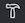
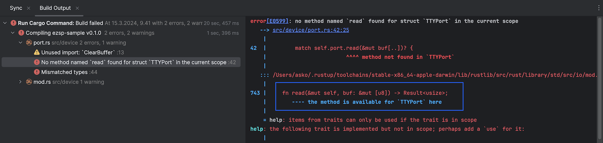

#RustRover

If you are using the [RustRover IDE](https://www.jetbrains.com/rust/), here are some notes.

>Note: Rust Rover is in EAP (Early Access Preview); not expecting it to be flawless, yet!

## Syntax recognition falling behind

Press  and some errors are listed in build output.

However.. these are not reflected in the code editor highlighting?

If this happens, **restart the IDE** (`File` > `Invalidate Caches` > `Just restart`). That seems to help. :)

## Pay attention to the details

The titles to the left tell only part of the story.

Pay attention to what the actual build error (to the right) may say.

